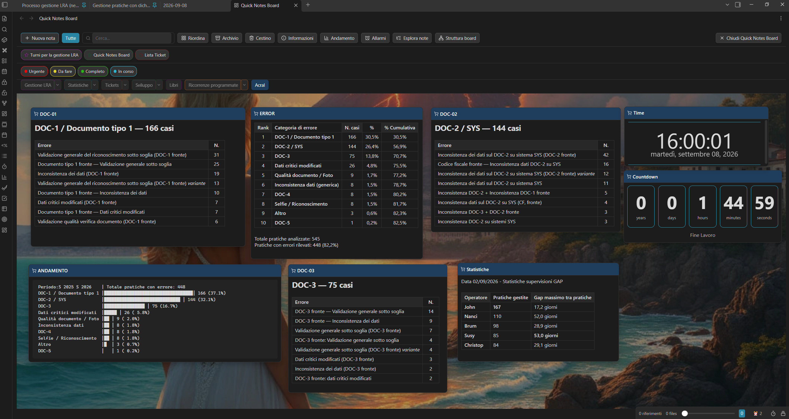
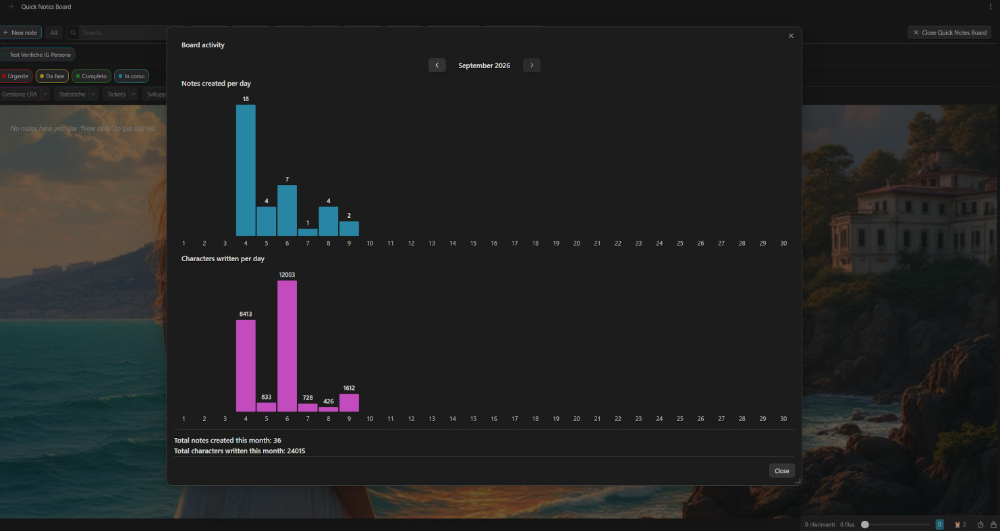
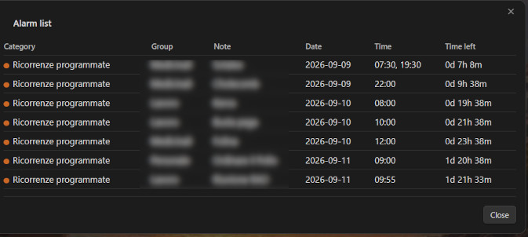
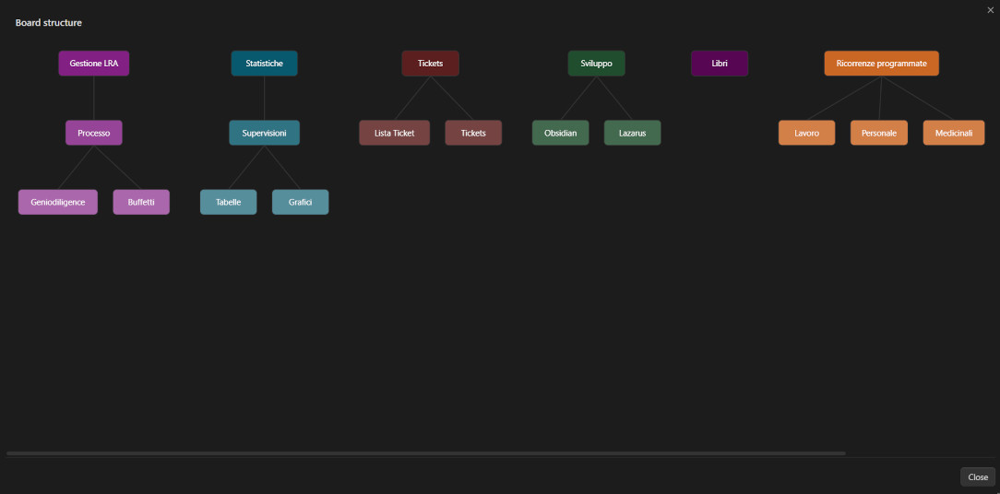
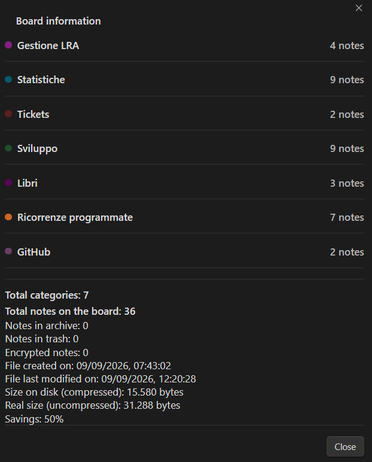
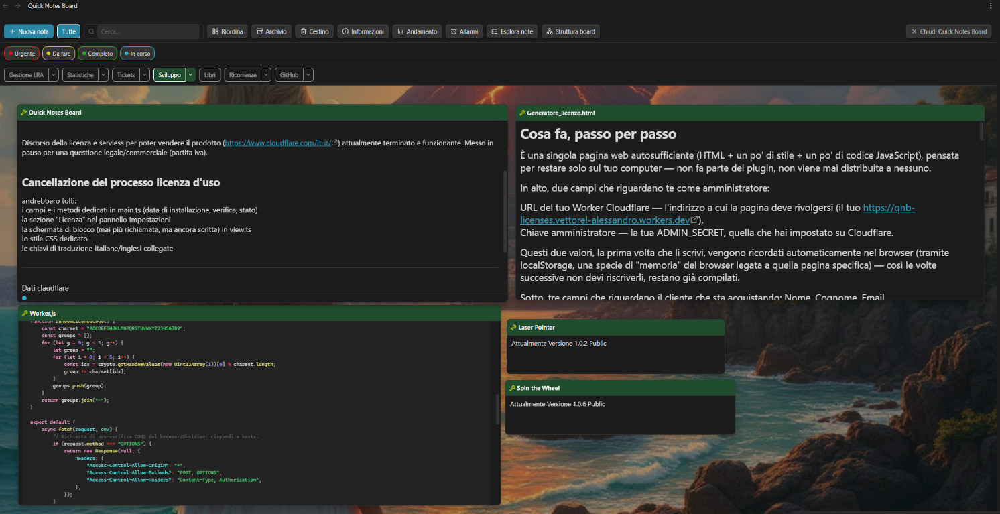

# Quick Notes Board

**Quick Notes Board** is a free, open-source Obsidian plugin for managing small notes fast, practically, and in a genuinely organized way. Instead of scattering quick thoughts across separate files, you get a dedicated board where notes live as draggable cards, sorted into **categories and groups** you define yourself — with instant search to put whatever you need right at your fingertips, no digging required.

It goes well beyond simple sticky notes: built-in **alarms and reminders** (including recurring ones and multiple times a day), **password-protected encrypted notes** for anything sensitive, and cross-cutting **labels** for finding and managing notes by what they have in common, regardless of which category they live in. Everything — every note, every setting — is saved in a **single file**, with optional **data compression** to keep it remarkably small on disk.

Customizable **sounds** for dozens of actions and smooth **window animations** round it out, for an experience that feels as good as it is fast — all of it, completely free.

---

## Screenshot



---

## Table of contents

1. [Installation](#installation)
2. [Opening and closing the board](#opening-and-closing-the-board)
3. [The toolbar](#the-toolbar)
4. [Quick notes](#quick-notes)
5. [Customizing note action icons](#customizing-note-action-icons)
6. [Text formatting](#text-formatting)
7. [Categories](#categories)
8. [Groups and subgroups](#groups-and-subgroups)
9. [Labels](#labels)
10. [Board Activity](#board-activity)
11. [Alarms and reminders](#alarms-and-reminders)
12. [Note Explorer](#note-explorer)
13. [Board Structure diagram](#board-structure-diagram)
14. [Trash](#trash)
15. [Archive](#archive)
16. [Password lock (encryption)](#password-lock-encryption)
17. [Board appearance](#board-appearance)
18. [Data file compression](#data-file-compression)
19. [Sound effects](#sound-effects)
20. [Language](#language)
21. [Data file format](#data-file-format)
22. [Screenshots](#screenshots)
23. [Version history](#version-history)
24. [Development](#development)

---

## Installation

Requires Node.js.

```bash
npm install
npm run build
```

This produces `main.js` in the project folder. Copy these three files into `<vault>/.obsidian/plugins/quick-notes-board/` in your vault:

- `main.js`
- `manifest.json`
- `styles.css`

Reload third-party plugins in Obsidian (or restart the app) and enable "Quick Notes Board" from the installed plugins list.

---

## Opening and closing the board

- **Ribbon icon** (left sidebar): opens the board. If it's already open, clicking it again **closes** it — it works as a toggle, both from the icon and from the matching command.
- The board opens in a full-width pane, like a regular note.
- Closing the board (from the dedicated toolbar button, the tab's "X", or the ribbon icon again) restores everything to normal, including automatically reopening any side panels that were closed for [fullscreen mode](#board-appearance).

---

## The toolbar

The top bar contains, from left to right:

| Element | Function |
|---|---|
| **New note** | Opens the creation window for a new quick note (title, category, optional group). |
| **All** | Shows/hides **all** active notes at once (not trashed nor archived). Automatically disables itself when there's nothing to show or hide. |
| **Category buttons** | One per registered category, colored like the category itself. Click to show/hide only that category's notes. If the category has [groups](#groups-and-subgroups), a small arrow next to it opens a menu with the individual groups. |
| **Reorder** | Tidies up the visible notes into a grid. Cycles through **five modes** on each click, in sequence: current position (reading order), smallest→largest horizontal, largest→smallest horizontal, smallest→largest vertical, largest→smallest vertical. Size-based modes always stay within the visible width — only vertical scrolling is ever needed, never horizontal. A short message after each click tells you which mode was just applied. |
| **Info** | Opens a summary window: total notes, categories, trashed/archived/encrypted notes, file size (and, [when compression is on](#data-file-compression), the real vs. compressed size and the resulting savings). |
| **Activity** | Opens the [Board Activity](#board-activity) window: a resizable bar chart of notes created and characters written per day, browsable by month. |
| **Alarms** | Opens the [alarm list](#alarms-and-reminders) — every note with an alarm set, at a glance. |
| **Explore notes** | Opens the [Note Explorer](#note-explorer) — a searchable, collapsible overview of every note by category/group/subgroup. |
| **Board structure** | Opens the [Board Structure diagram](#board-structure-diagram) — a read-only flowchart of your categories, groups and subgroups. |
| **Archive** | Opens the [archive](#archive) window. |
| **Trash** | Opens the [trash](#trash) window. |
| **Close Quick Notes Board** | Closes the board (same as clicking the ribbon icon again). |

Category/group/"All" buttons automatically disable themselves (appear faded, not clickable) when there are no relevant notes to show or hide.

If you've defined any [labels](#labels), a second row appears below the category buttons with a colored chip per label, for filtering notes by label.

---

## Quick notes

Each note is a small draggable card with:

- A **colored header**, matching its category, with the category's icon (if any) and the note's title.
- A **text body** in Markdown, previewed exactly like a real Obsidian note.
- A row of action icons — fully reorderable and individually hideable, see [Customizing note action icons](#customizing-note-action-icons). The default order:

| Icon | Action |
|---|---|
| Pencil | Renames the note's title (inline editing, in place). |
| Tag | Changes the note's category (and, if applicable, group). |
| "A" (typography) | Opens the **Text appearance** panel: size, font, text color, background color (see below). |
| Eye / pencil | Toggles between rendered preview and raw-text editing. |
| Archive box | Moves the note to the [archive](#archive). |
| File-plus | Converts the quick note into a real note file in your vault, opening it afterwards. |
| Lock | Locks/unlocks the note with a password (see [Password lock](#password-lock-encryption)). |
| Trash | Moves the note to the [trash](#trash). |
| Star | Marks the note as a favorite (only shown if favorites are enabled in settings). |
| Alarm clock | Sets or edits the note's [alarm](#alarms-and-reminders). |
| Maximize/restore | Expands the note to fill the whole board (or restores it to its original position and size). Never moves or resizes the note's saved data — it's a purely visual, reversible overlay. |
| Pin | Pins the note so it always shows up front, ignoring the usual show/hide-by-category behavior. |
| Tags | Opens the panel to assign/remove [labels](#labels) for this note. |
| **X** (fixed, always last) | Minimizes (hides) the note without deleting it. Comes back into view by re-clicking its category (or group) button in the toolbar, from the [Note Explorer](#note-explorer), or from a matching [label filter](#labels). |

**Dragging**: move a note by holding down its header. The last note you touched (moved, opened, edited) always comes to the front.

**Resizing**: from the left, right, and bottom edges, and the two bottom corners (not the top, which is reserved for dragging).

**Zooming a single note's text**: hover over a note's body and use **Ctrl + mouse wheel** (or pinch-to-zoom on a Mac trackpad) to grow or shrink just that note's font size, one step at a time, within the same 10–32px range as the appearance panel's slider. Saved automatically after a short pause. Normal scrolling (without Ctrl) is unaffected.

**Positioning the cursor precisely**: clicking (or double-clicking, depending on your settings) into a note's text places the cursor exactly where you clicked — not always at the end — and scrolls the note so that line is visible. Exact for plain text; a close approximation on lines with Markdown formatting.

**Compact icons** *(optional, from settings)*: when enabled, action icons stay hidden until you hover over the note, edit it, or drag it — for a cleaner look with many notes on the board. Can be turned off at any time.

**Footer bar**: a thin strip at the bottom of a note, above the resize handles, appears whenever the note has at least one label assigned, showing its colored dots left-aligned. Designed to be extensible for future small additions.

---

## Customizing note action icons

From **Settings → Note icons**, you can:

- **Drag to reorder** the 13 action icons (all except the fixed "X" close button) using the handle on the left of each row — same drag-and-drop mechanism used for reordering groups.
- **Toggle visibility** of each one individually — hide the icons you never use.

Changes apply immediately to every open note on the board.

---

## Text formatting

The note's body supports the same Markdown as regular Obsidian notes:

- **Bold** and *italic* (shortcuts **Ctrl/Cmd+B** and **Ctrl/Cmd+I** while editing).
- **Internal links** `[[note name]]`: clickable (open the note; Ctrl/Cmd+click opens it in a new tab) with hover preview, just like in a regular note. While editing, typing `[[` (or **Ctrl/Cmd+K**) opens an **autocomplete** suggester that combines matching vault notes and other quick notes on the board — picking a quick note inserts a special link that, when clicked, brings that note into view and highlights it (even if it was hidden or archived).
- **Embedded images** `![[image.jpg]]`, resizable by dragging a handle on their corner.
- **Tables**, with borders and a highlighted header row; they resize correctly when you change the note's font size.
- **Checkboxes** `- [ ]`: clickable, and the click genuinely updates and saves the note's text. A **progress bar** can optionally be shown above each checklist, with a customizable color gradient and a distinct color/text once it reaches 100%.

While editing, the text stays a plain editable area (no live formatting as you type), to keep it light and reliable; once you leave editing mode, everything renders correctly.

### Text appearance (per note)

From the "A" panel on each note:

- **Size** (slider, 10–32px — also adjustable with Ctrl+scroll wheel directly on the note, see above).
- **Font**: 6 generic families (default, sans-serif, serif, monospace, decorative script, decorative display) plus 10 common named fonts with safe fallbacks (Arial, Georgia, Times New Roman, Courier New, Verdana, Trebuchet MS, Palatino, Garamond, Comic Sans MS, Impact).
- **Text color** and **background color** for that single note, with a "Default" button to return to automatic behavior.

All changes apply live as you adjust them.

---

## Categories

Categories are managed from **Settings → Quick Notes Board**. For each one you can define:

- **Name** (editable at any time; notes belonging to it update automatically).
- **Background color** for the note header.
- **Title text color**, with a "Default" option (contrast automatically computed from the background color).
- **Icon**, shown before the title of every note in that category, and before its name everywhere else it appears (toolbar, [Note Explorer](#note-explorer), [Board Structure](#board-structure-diagram)): a gallery of 24 ready-to-use common icons, plus a free-text field to type the name of **any** icon from the Lucide library (with a live preview and a button that opens `lucide.dev/icons` to search), and a dedicated color for the icon itself.
- Category order (reflected in the toolbar) can be **dragged and reordered** using the handle on the left of each row.

At least one category must always remain.

---

## Groups and subgroups

Each category can have its own internal breakdown into **groups** (and nested subgroups), managed in the dedicated section under each category in settings (name, add, rename, delete, drag to reorder). A group always inherits its parent category's color and icon — it has no appearance of its own.

When creating a note or changing its category, if the chosen category has groups defined, a second menu appears to assign it to one of them (or none). Changing a note's category automatically resets its group.

In the toolbar, categories with groups show a small arrow: it opens a popup menu with the groups, each individually showable/hideable, independently from the rest of the category.

---

## Labels

Labels are a **flat, cross-cutting** tagging system, independent from categories/groups/subgroups — a note can carry several labels at once, useful for finding notes that share something in common regardless of where they're organized (e.g. "Urgent" and "Waiting on someone else" together, across completely different categories).

- Managed from **Settings → Labels**: name, color, add/delete, drag to reorder.
- Assign labels to a note from its dedicated **Tags** icon, via checkboxes (as many as you like at once).
- Assigned labels show as small colored dots in the note's [footer bar](#quick-notes), and (read-only) in the note's info panel (right-click the title).
- The toolbar's **label filter row** lets you click one or more label chips: selecting more than one **intersects** them (AND) — only notes carrying *every* selected label are shown, not just any one of them. Active exactly like the search box: it temporarily reveals matching notes even if their category is currently closed, without ever changing their underlying hidden/shown state.
- The toolbar search box and [Note Explorer](#note-explorer) also match against label names, not just note titles.

---

## Board Activity



The toolbar's "Activity" button opens a resizable window with two bar charts, browsable month by month: **notes created per day** and **characters written per day**, plus the running totals for the selected month. It's a quick way to see, at a glance, how many notes and how many characters you've actually created and typed in the current month — a simple but effective way to track your writing/working pace over time, spot your most productive days, or just confirm you're keeping up a steady habit. Hovering over a bar shows the exact value for that day; the colors of both charts are customizable from settings.

---

## Alarms and reminders



Set from the alarm clock icon on a note. The panel lets you configure:

- **Alarm date** (the deadline).
- **Reminder start date** (when the alarm window begins — can be before the deadline, for advance notice).
- **Reminder start time**, or, if you enable **"Multiple times in the same day"**, a whole list of times instead of just one (e.g. 8:00, 14:00 and 22:00 for a recurring medication reminder) — each one rings independently on the same day.
- **Repeat interval** (every N minutes) the alarm keeps re-ringing after being stopped, for single-time alarms.
- **Repeat**: none, daily, weekly, monthly, or yearly, with an "every N [days/weeks/months]" option. Only moves forward when you explicitly click **"Postpone to next alarm"** — never automatically.
- **Skip Saturday and Sunday**: when enabled, the alarm sends no notification or sound, and the note shows no blinking border, on weekends — resuming on its own the following Monday. Applies to every scheduled time together.

**How it behaves**: once the alarm window opens, the note gets a blinking colored border (customizable in settings) and a looping sound alarm starts, together with a persistent notification — it keeps ringing until you stop it, by clicking the notification or the note's alarm icon. With a single daily time, stopping it means it will ring again after the configured interval if you don't fully resolve it. With **multiple times in the same day**, stopping it resolves every time slot due so far at once, and it then stays silent until the *next* scheduled time arrives — it never resumes nagging in between. Border and sound are always checked on the same 5-second cadence, so they never fall out of sync with each other.

**Alarm list**: the toolbar's "Alarms" button shows every note with an alarm set, grouped by category/group/subgroup, with its due date, time(s), and a live "time remaining" countdown (days/hours/minutes, or "Overdue"). Clicking a row opens that note's alarm panel directly.

---

## Note Explorer

The toolbar's "Explore notes" button opens a complete overview of every quick note (trash and archive excluded), organized by **category → group → subgroup**, with each category's icon shown before its name (and before every group/subgroup under it) for quick visual orientation. A search box at the top filters by title or label name.

All categories start **collapsed** — only category names are visible until you click one to expand it. Searching automatically expands any category containing a match, and once expanded that way it stays expanded even after you clear the search (no memory between separate openings of the window, though).

Clicking a note brings it into view on the board, highlighted — even if it was hidden or archived.

---

## Board Structure diagram



The toolbar's "Board structure" button opens a resizable, read-only flowchart: a box per category (full color) with its groups and subgroups branching below it (progressively lighter shades of the same color, so you can tell the depth apart at a glance), connected by lines — no notes shown, just the organizational skeleton, for getting your bearings when you have many categories and groups. Nothing is clickable; it's purely informational.

---

## Trash

Clicking the trash icon on a note does **not** delete it permanently: it moves to the "Trash" window, reachable from the toolbar, where for each note you can:

- **Restore it** (back to the board, in its original category/position).
- **Delete it permanently.**

Each entry shows its size in bytes (exactly as it would be written to disk), and the window's footer shows the **total space that would be reclaimed** by emptying the trash. The **"Empty trash"** button deletes everything trashed in one go.

---

## Archive

Works similarly to the trash, but for a different purpose: archiving a note hides it from the board without marking it "to be deleted". From the "Archive" window, each note can be:

- **Restored** to the board.
- **Sent to the trash** (from there, eventually, deleted permanently).

Archived notes are always excluded from the board's normal filters and views.

---

## Password lock (encryption)

Any note can be individually protected with a password, via the lock icon.

- **Algorithm**: AES-256-GCM (authenticated encryption: a wrong password or tampered data explicitly fails decryption, instead of returning garbled text).
- **Key derivation**: PBKDF2-SHA256, with a random salt generated per note and 250,000 iterations.
- **Locking**: requires a password with confirmation; the content is encrypted and replaced on disk.
- **Unlocking**: requires the password; if wrong, a warning stays visible and you can try again, without altering the saved data in any way.
- A locked note shows a closed-padlock icon before its title and placeholder text instead of its content; it can't be edited until unlocked.
- **The password is never saved anywhere**: if forgotten, the encrypted content cannot be recovered in any way. The note's title and category always stay in plain text (needed for lists, trash, archive); only the note's text body is encrypted.

---

## Board appearance

From settings you can also customize the background behind the notes:

- **Default**: a dotted background.
- **Image**: an image file chosen from disk (copied into the plugin's folder), with a fit mode (cover/contain/repeat) and a darkening slider to keep notes readable over it.
- **Solid color**: any color, including from a preset palette.

**Fullscreen mode** *(optional)*: when enabled, opening the board closes Obsidian's side panels for more room, and reopens them automatically when you close the board — but only the ones that were actually open beforehand.

---

## Data file compression



From **Settings**, you can enable compressing the data file on disk (typically a **70–90% size reduction**, since the file's repetitive metadata compresses especially well).

- **Off by default.** Toggling it recompresses (or decompresses) the file **immediately** — never left half-done waiting for the next unrelated save.
- **Always safely auto-detected on read**, via a marker at the start of the file — never based on the current setting. This means changing the toggle can never cause an existing file to be misread, whether it's on or off at the time.
- If a compressed file turns out to be **corrupted** (unreadable), the plugin refuses to save over it — it stops and shows a persistent warning instead of silently overwriting your data.
- With compression on, the **Info** window shows the compressed size, the real (uncompressed) size, and the resulting percentage saved.

⚠️ While compressed, the data file is **no longer readable or editable with a plain text editor** — only the plugin can interpret it. Keep this in mind before enabling it if you value being able to open the file by hand.

---

## Sound effects

The plugin can play a customizable sound for **dozens of distinct events**, organized by group in **Settings → Sound effects**:

- **Note buttons**: rename, change category, text appearance, view/edit, maximize/restore, archive, delete, lock, unlock, wrong password, labels.
- **Toolbar**: open board, new note, toggle category, show/hide all, toggle label filter, open archive, open trash, open alarm list, open note explorer, open board structure, close board.
- **Window openings**: each of the plugin's dialog windows.
- **Confirmation and trash/archive buttons**: create note, apply category, close appearance window, restore, delete permanently, empty trash, send to trash from archive.
- **Alarms**: due-date reminder ringing, opening the due-date panel.

**How it works**: audio files (mp3, wav, ogg, m4a) must be copied manually into the plugin's folder (`.obsidian/plugins/quick-notes-board/`). Each row in the Sound effects section is a dropdown listing the files found there — no file picker, no automatic copying: several events can share the same file this way without duplicates. The "Refresh" button re-scans the folder if you add files while Obsidian is open.

---

## Language

The plugin's interface (buttons, labels, windows, messages) is available in **Italian** (default) and **English**, selectable from settings and applied immediately, no need to restart Obsidian. The data file's format and the names you assign yourself (categories, groups, labels, note titles) are never automatically translated: they always stay exactly as you wrote them.

---

## Data file format

All active, trashed, and archived notes are saved in a single, human-readable file, `Quick notes board.md`, inside the plugin's folder — organized by category, with each note's position, size, and every other property (font, colors, encrypted state, group, labels, alarm settings, etc.) encoded in a `%% QNB ... %%` block next to its title and text. The file is designed to be easy to read, but it's best not to edit it by hand, to avoid breaking its structure.

If [data compression](#data-file-compression) is enabled, the file instead starts with a `%% QNB-COMPRESSED v1 %%` marker followed by compressed, base64-encoded content — no longer human-readable directly, but still auto-detected correctly regardless of the current setting.

---

## Screenshots



---

## Version history

### 1.0.2

Bug fixes and visual polish, no new features.

- Fixed note resizing from the left edge: after moving (dragging) a note and then resizing it from its left handle, the left border could stay stuck in place instead of moving, while the right border moved instead — caused by a positioning inconsistency between dragging and resizing. Dragging now uses the same positioning method as resizing, so this can no longer happen.
- Fixed the Alarms list's "time remaining" countdown showing "0d 0h 0m" for alarms less than a minute away (most noticeable with multiple daily times set only a few minutes apart) — now shows "Less than 1 minute" instead.
- Fixed the toolbar's Trash/Archive buttons showing their icon stacked above the text instead of beside it.
- Fixed the small arrow that expands a category's groups/subgroups losing its icon after the above fix.
- Fixed the categories row sitting too close to the toolbar's top border, and the group-expand arrow visually overlapping the category button next to it — both are now properly spaced and cleanly merged into a single control.
- Category buttons in the toolbar now use a fixed white border/text color while inactive, for consistent readability regardless of the category's own color (which some users found hard to read); active categories are unaffected and still show their own color as before.
- Added a GitHub Actions workflow that automatically builds, attests, and publishes a release (with `main.js`, `manifest.json`, `styles.css`) whenever a version tag is pushed.

### 1.0.1

Maintenance release: no user-facing feature changes, but requires **Obsidian 1.13.0** or later (was 1.7.2).

- Settings now use Obsidian's new declarative settings API, so every option is findable from the global Settings search.
- Fixed a bug where, with multiple daily alarm times on the same note, reopening Obsidian after one time had already passed (but before the next) could trigger a sound/notification at an unrelated, unexpected moment instead of staying silent until the next scheduled time.
- Fixed the Alarms list's "time remaining" countdown for notes with multiple daily times: it now counts down to the next upcoming time instead of staying anchored to the first one of the day (which showed "Overdue" as soon as that first alarm had rung, even with a later one still pending).
- Various internal fixes flagged by Obsidian's plugin review (deprecated API usage, minor code cleanup) — no behavior change.

### 1.0.0

First public release. Highlights include:

- **Labels**: a flat, cross-cutting tagging system independent from categories/groups, with multi-select assignment, colored dots on notes, and an intersecting (AND) filter row in the toolbar.
- **Note Explorer**: a searchable, collapsible overview of every note organized by category → group → subgroup.
- **Board Structure diagram**: a read-only flowchart visualizing the whole category/group/subgroup hierarchy.

---

## Development

```bash
npm run dev
```

Automatically rebuilds on every change to the source files (`main.ts`, `view.ts`, `settings.ts`, `modal.ts`, `i18n.ts`, `crypto.ts`).

### Project structure

| File | Contents |
|---|---|
| `main.ts` | The main plugin class: loading/saving data and settings, categories/groups/labels/sounds/background management, the alarm-checking engine, data file compression. |
| `view.ts` | The board itself: toolbar, notes, dragging, resizing, rendering, note action icons. |
| `settings.ts` | The settings panel. |
| `modal.ts` | The dialog windows (new note, change category, text appearance, lock/unlock, trash, archive, alarm list, note explorer, board structure, due-date panel, label assignment, and more). |
| `crypto.ts` | Encryption/decryption of note content. |
| `i18n.ts` | Translation dictionaries (IT/EN) and the translation function. |
| `styles.css` | All of the plugin's visual styling. |
