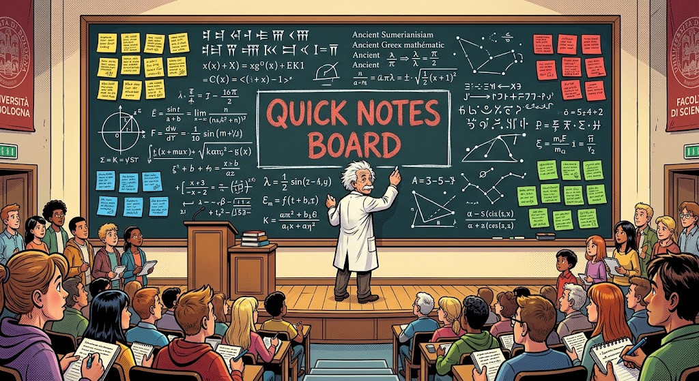
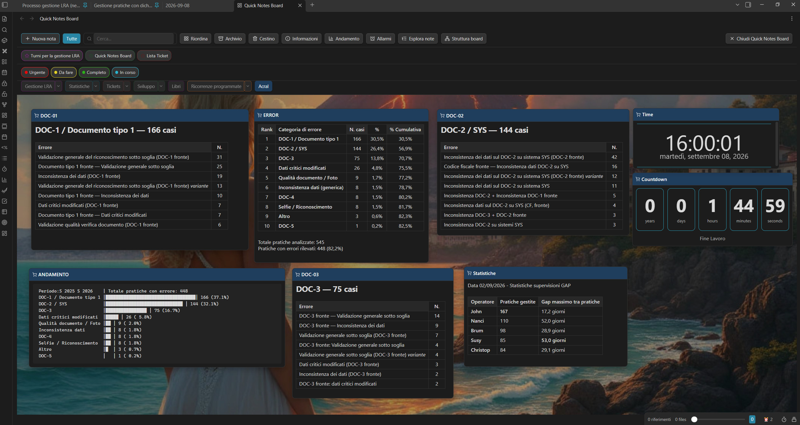
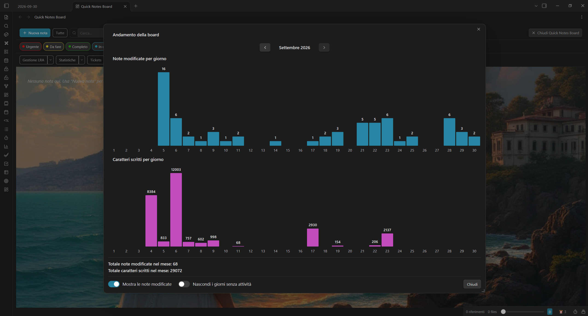
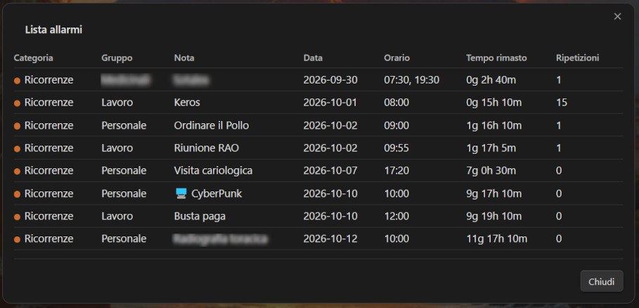
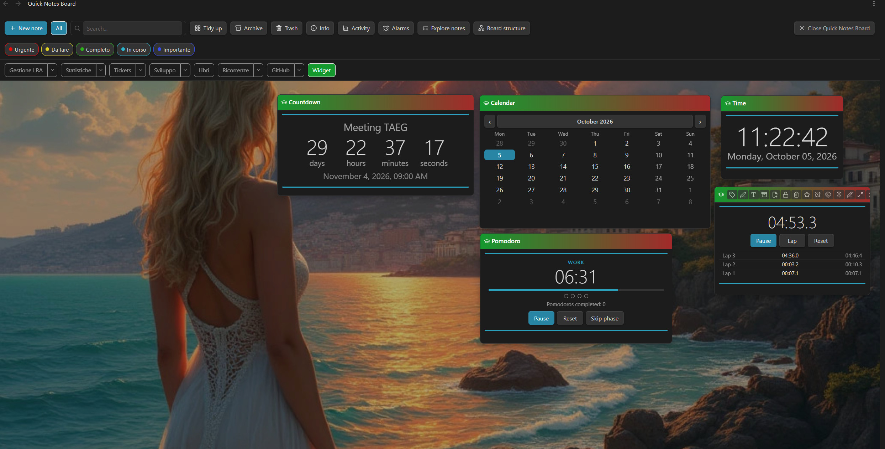
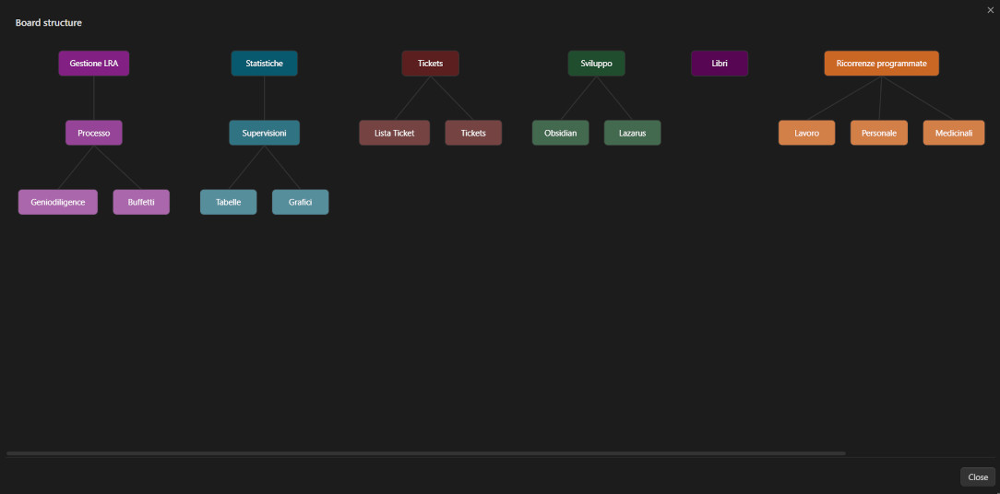
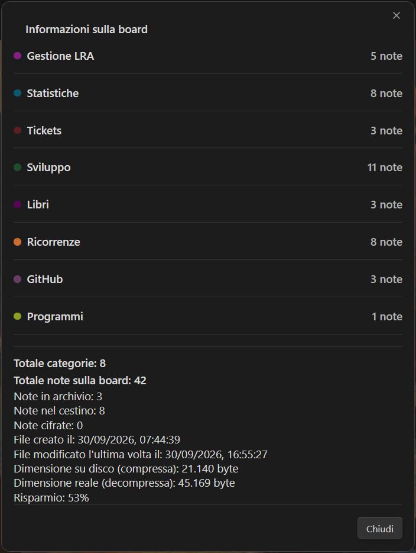
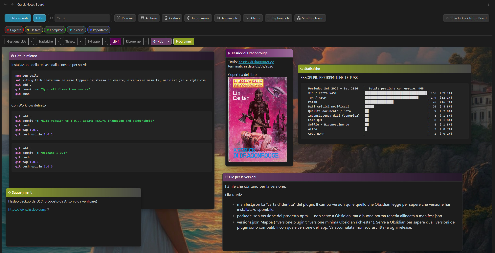

# Quick Notes Board



**Quick Notes Board** is a free, open-source Obsidian plugin for managing small notes fast, practically, and in a genuinely organized way. Instead of scattering quick thoughts across separate files, you get a dedicated board where notes live as draggable cards, sorted into **categories and groups** you define yourself — with instant search to put whatever you need right at your fingertips, no digging required.

It goes well beyond simple sticky notes: built-in **alarms and reminders** (including recurring ones and multiple times a day), **password-protected encrypted notes** for anything sensitive, and cross-cutting **labels** for finding and managing notes by what they have in common, regardless of which category they live in. Everything — every note, every setting — is saved in a **single file**, with optional **data compression** to keep it remarkably small on disk.

Customizable **sounds** for dozens of actions and smooth **window animations** round it out, for an experience that feels as good as it is fast — all of it, completely free.

---

## Screenshot



---

## Table of contents

1. [Installation](#installation)
2. [Opening and closing the board](#opening-and-closing-the-board)
3. [The toolbar](#the-toolbar)
4. [Quick notes](#quick-notes)
5. [Customizing note action icons](#customizing-note-action-icons)
6. [Text formatting](#text-formatting)
7. [Categories](#categories)
8. [Groups and subgroups](#groups-and-subgroups)
9. [Labels](#labels)
10. [Board Activity](#board-activity)
11. [Alarms and reminders](#alarms-and-reminders)
12. [Note widgets](#note-widgets)
13. [Note Explorer](#note-explorer)
14. [Board Structure diagram](#board-structure-diagram)
15. [Trash](#trash)
16. [Archive](#archive)
17. [Password lock (encryption)](#password-lock-encryption)
18. [Board appearance](#board-appearance)
19. [Data file compression](#data-file-compression)
20. [Sound effects](#sound-effects)
21. [Language](#language)
22. [What's new after an update](#whats-new-after-an-update)
23. [Data file format](#data-file-format)
24. [Screenshots](#screenshots)
25. [Version history](#version-history)
26. [Development](#development)

---

## Installation

Requires Node.js.

```bash
npm install
npm run build
```

This produces `main.js` in the project folder. Copy these three files into `<vault>/.obsidian/plugins/quick-notes-board/` in your vault:

- `main.js`
- `manifest.json`
- `styles.css`

Reload third-party plugins in Obsidian (or restart the app) and enable "Quick Notes Board" from the installed plugins list.

---

## Opening and closing the board

- **Ribbon icon** (left sidebar): opens the board. If it's already open, clicking it again **closes** it — it works as a toggle, both from the icon and from the matching command.
- The board opens in a full-width pane, like a regular note.
- Closing the board (from the dedicated toolbar button, the tab's "X", or the ribbon icon again) restores everything to normal, including automatically reopening any side panels that were closed for [fullscreen mode](#board-appearance).

---

## The toolbar

The top bar contains, from left to right:

| Element | Function |
|---|---|
| **New note** | Opens the creation window for a new quick note (title, category, optional group). |
| **All** | Shows/hides **all** active notes at once (not trashed nor archived). Automatically disables itself when there's nothing to show or hide. |
| **Category buttons** | One per registered category, colored like the category itself. Click to show/hide only that category's notes. If the category has [groups](#groups-and-subgroups), a small arrow next to it opens a menu with the individual groups. |
| **Reorder** | Tidies up the visible notes into a grid. Cycles through **six modes** on each click, in sequence: current position (reading order), smallest→largest horizontal, largest→smallest horizontal, smallest→largest vertical, largest→smallest vertical, and **cascade**. Size-based modes always stay within the visible width — only vertical scrolling is ever needed, never horizontal. In cascade mode the notes are stacked from the oldest (at the back) to the newest (in front), each shifted down by one title bar and slightly to the right, so every note's title stays readable; if the stack doesn't fit the visible height, a new cascade starts to the right of the previous one. Stacking order isn't saved, so after a restart it depends on the order notes are loaded (the positions are kept). A short message after each click tells you which mode was just applied. |
| **Info** | Opens a summary window: total notes, categories, trashed/archived/encrypted notes, file size (and, [when compression is on](#data-file-compression), the real vs. compressed size and the resulting savings). |
| **Activity** | Opens the [Board Activity](#board-activity) window: a resizable bar chart of notes created and characters written per day, browsable by month. |
| **Alarms** | Opens the [alarm list](#alarms-and-reminders) — every note with an alarm set, at a glance. |
| **Explore notes** | Opens the [Note Explorer](#note-explorer) — a searchable, collapsible overview of every note by category/group/subgroup. |
| **Board structure** | Opens the [Board Structure diagram](#board-structure-diagram) — a read-only flowchart of your categories, groups and subgroups. |
| **Archive** | Opens the [archive](#archive) window. |
| **Trash** | Opens the [trash](#trash) window. |
| **Close Quick Notes Board** | Closes the board (same as clicking the ribbon icon again). |

Category/group/"All" buttons automatically disable themselves (appear faded, not clickable) when there are no relevant notes to show or hide.

If you've defined any [labels](#labels), a second row appears below the category buttons with a colored chip per label, for filtering notes by label.

---

## Quick notes

Each note is a small draggable card with:

- A **colored header**, matching its category, with the category's icon (if any) and the note's title.
- A **text body** in Markdown, previewed exactly like a real Obsidian note — or a live [widget](#note-widgets) (clock, calendar, countdown, stopwatch, pomodoro) in its place.
- A row of action icons — fully reorderable and individually hideable, see [Customizing note action icons](#customizing-note-action-icons). The default order:

| Icon | Action |
|---|---|
| Pencil | Renames the note's title (inline editing, in place). |
| Tag | Changes the note's category (and, if applicable, group). |
| "A" (typography) | Opens the **Text appearance** panel: size, font, text color, background color (see below). |
| Eye / pencil | Toggles between rendered preview and raw-text editing. |
| Archive box | Moves the note to the [archive](#archive). |
| File-plus | Converts the quick note into a real note file in your vault, opening it afterwards. |
| Lock | Locks/unlocks the note with a password (see [Password lock](#password-lock-encryption)). |
| Trash | Moves the note to the [trash](#trash). |
| Star | Marks the note as a favorite (only shown if favorites are enabled in settings). |
| Alarm clock | Sets or edits the note's [alarm](#alarms-and-reminders). |
| Maximize/restore | Expands the note to fill the whole board (or restores it to its original position and size). Never moves or resizes the note's saved data — it's a purely visual, reversible overlay. |
| Pin | Pins the note so it always shows up front, ignoring the usual show/hide-by-category behavior. |
| Tags | Opens the panel to assign/remove [labels](#labels) for this note. |
| **X** (fixed, always last) | Minimizes (hides) the note without deleting it. Comes back into view by re-clicking its category (or group) button in the toolbar, from the [Note Explorer](#note-explorer), or from a matching [label filter](#labels). |

**Performance**: a note scrolled out of the board's visible area stops being rendered (and animated, if its category has an animated gradient) by the browser until you scroll back — invisible in normal use, but it keeps a crowded board light. Notes hidden by a category or individually closed cost nothing at all, already: they're never even added to the page in the first place.

**Dragging**: move a note by holding down its header. The last note you touched (moved, opened, edited) always comes to the front.

**Resizing**: from the left, right, and bottom edges, and the two bottom corners (not the top, which is reserved for dragging).

**Zooming a single note's text**: hover over a note's body and use **Ctrl + mouse wheel** (or pinch-to-zoom on a Mac trackpad) to grow or shrink just that note's font size, one step at a time, within the same 10–32px range as the appearance panel's slider. Saved automatically after a short pause. Normal scrolling (without Ctrl) is unaffected.

**Positioning the cursor precisely**: clicking (or double-clicking, depending on your settings) into a note's text places the cursor exactly where you clicked — not always at the end — and scrolls the note so that line is visible. Exact for plain text, headings, quotes, bullet/task lists, tables and inline formatting (bold, italic, strikethrough, highlight, inline code); a close approximation on deeply nested lists, numbered lists past the ninth item, and hand-padded table columns; links, wiki-links and fenced ```code``` blocks fall back to the previous, less precise behavior.

**Compact icons** *(optional, from settings)*: when enabled, action icons stay hidden until you hover over the note, edit it, or drag it — for a cleaner look with many notes on the board. While hidden, the icon row also collapses to no width, so the title gets that space back and shows more of itself instead of staying cut short next to empty room; hovering smoothly brings the icons back and the title yields space to them again. Can be turned off at any time.

**Footer bar**: a thin strip at the bottom of a note, above the resize handles, appears whenever the note has at least one label assigned, showing its colored dots left-aligned. Designed to be extensible for future small additions.

---

## Customizing note action icons

From **Settings → Note icons**, you can:

- **Drag to reorder** the 13 action icons (all except the fixed "X" close button) using the handle on the left of each row — same drag-and-drop mechanism used for reordering groups.
- **Toggle visibility** of each one individually — hide the icons you never use.

Changes apply immediately to every open note on the board.

---

## Text formatting

The note's body supports the same Markdown as regular Obsidian notes:

- **Bold** and *italic* (shortcuts **Ctrl/Cmd+B** and **Ctrl/Cmd+I** while editing).
- **Internal links** `[[note name]]`: clickable (open the note; Ctrl/Cmd+click opens it in a new tab) with hover preview, just like in a regular note. While editing, typing `[[` (or **Ctrl/Cmd+K**) opens an **autocomplete** suggester that combines matching vault notes and other quick notes on the board — picking a quick note inserts a special link that, when clicked, brings that note into view and highlights it (even if it was hidden or archived).
- **Embedded images** `![[image.jpg]]`, resizable by dragging a handle on their corner.
- **Tables**, with borders and a highlighted header row; they resize correctly when you change the note's font size.
- **Checkboxes** `- [ ]`: clickable, and the click genuinely updates and saves the note's text. A **progress bar** can optionally be shown above each checklist, with a customizable color gradient and a distinct color/text once it reaches 100%.

While editing, the text stays a plain editable area (no live formatting as you type), to keep it light and reliable; once you leave editing mode, everything renders correctly.

### Text appearance (per note)

From the "A" panel on each note:

- **Size** (slider, 10–32px — also adjustable with Ctrl+scroll wheel directly on the note, see above).
- **Font**: 6 generic families (default, sans-serif, serif, monospace, decorative script, decorative display) plus 10 common named fonts with safe fallbacks (Arial, Georgia, Times New Roman, Courier New, Verdana, Trebuchet MS, Palatino, Garamond, Comic Sans MS, Impact).
- **Text color** and **background color** for that single note, with a "Default" button to return to automatic behavior.

All changes apply live as you adjust them.

---

## Categories

Categories are managed from **Settings → Quick Notes Board**. For each one you can define:

- **Name** (editable at any time; notes belonging to it update automatically).
- **Background color** for the note header, optionally as a **gradient**: turn on **Background gradient** and pick an end color and a direction (left→right, right→left, top→bottom, bottom→top, or either 45° diagonal). Right under the end color, a **Title bar animation** toggle makes the gradient slide smoothly back and forth instead of staying still, at a **duration** you set from 1 to 10 seconds; with it off the bar is static exactly as before, and turning it back on picks up the duration and hover setting you last used. A further **"Animate only while hovering or editing"** toggle keeps the bar static until you hover the note, edit it, or drag it (the same moments the [compact icons](#quick-notes) setting reveals the action icons) — off by default, so the gradient animates all the time unless you turn this on. It's a plain CSS animation (no background timer), and it's skipped automatically if you have your system's "reduce motion" setting on. The category color is the gradient's start, and with the gradient toggle off the header is a single color exactly as before. Right under the colors, a **live preview bar** (a mock note title with the category name and icon, in the text and icon colors it will really have) always shows the result — single color, still gradient, or animated — and updates as you change colors, icon or gradient. The gradient (animated or not) applies to the note header bars only; everywhere else the category color is still used as a single color.
- **Title text color**, with a "Default" option (contrast automatically computed from the background color).
- **Icon**, shown before the title of every note in that category, and before its name everywhere else it appears (toolbar, [Note Explorer](#note-explorer), [Board Structure](#board-structure-diagram)): a gallery of 24 ready-to-use common icons, plus a free-text field to type the name of **any** icon from the Lucide library (with a live preview and a button that opens `lucide.dev/icons` to search), and a dedicated color for the icon itself.
- Category order (reflected in the toolbar) can be **dragged and reordered** using the handle on the left of each row.

At least one category must always remain.

---

## Groups and subgroups

Each category can have its own internal breakdown into **groups** (and nested subgroups), managed in the dedicated section under each category in settings (name, add, rename, delete, drag to reorder). A group always inherits its parent category's color and icon — it has no appearance of its own.

When creating a note or changing its category, if the chosen category has groups defined, a second menu appears to assign it to one of them (or none). Changing a note's category automatically resets its group.

In the toolbar, categories with groups show a small arrow: it opens a popup menu with the groups, each individually showable/hideable, independently from the rest of the category.

---

## Labels

Labels are a **flat, cross-cutting** tagging system, independent from categories/groups/subgroups — a note can carry several labels at once, useful for finding notes that share something in common regardless of where they're organized (e.g. "Urgent" and "Waiting on someone else" together, across completely different categories).

- Managed from **Settings → Labels**: name, color, add/delete, drag to reorder.
- Assign labels to a note from its dedicated **Tags** icon, via checkboxes (as many as you like at once).
- Assigned labels show as small colored dots in the note's [footer bar](#quick-notes), and (read-only) in the note's info panel (right-click the title), which also has **Duplicate note**, **Archive** and **Trash** buttons, in that order (left of Close): the same actions as the matching icons on the note itself, always applied to this specific note regardless of any other notes selected elsewhere on the board. Duplicate note makes a full copy (text, category, group, colors, font, labels, alarm...) with a new id, placed 24px down and to the right of the original and brought to the front; the duplicate starts with no pending snooze and no repetitions counted, even if the original had some. Having Archive and Trash here too means you can hide those two [action icons](#customizing-note-action-icons) from the note header if you'd like a cleaner, less crowded title bar — the info panel keeps both one right-click away regardless.
- The toolbar's **label filter row** lets you click one or more label chips: selecting more than one **intersects** them (AND) — only notes carrying *every* selected label are shown, not just any one of them. Active exactly like the search box: it temporarily reveals matching notes even if their category is currently closed, without ever changing their underlying hidden/shown state.
- The toolbar search box and [Note Explorer](#note-explorer) also match against label names, not just note titles.

---

## Board Activity



The toolbar's "Activity" button opens a resizable window with two bar charts, browsable month by month: **notes created per day** and **characters written per day**, plus the running totals for the selected month. It's a quick way to see, at a glance, how many notes and how many characters you've actually created and typed in the current month — a simple but effective way to track your writing/working pace over time, spot your most productive days, or just confirm you're keeping up a steady habit. Hovering over a bar shows the exact value for that day; the colors of both charts are customizable from settings.

At the bottom-left of the window, the **"Hide days with no activity"** toggle removes every day with no notes created and no characters written from both charts, so they show only the days you actually worked (bars are capped to a sensible width when few days remain, and a message is shown if the month has no activity at all). The totals are unaffected, and the toggle's state is remembered.

Next to it, the **"Show modified notes"** toggle swaps the first chart for **notes modified per day**, on the same calendar (the characters chart stays as is, and the monthly total changes accordingly). Like the other toggle, its state is remembered between openings. Modifications come from a dedicated daily activity log — not from each note's last-modified date, which would only remember the latest edit — so a note edited on several different days appears on every one of them. Each note counts once per day, however many times it's saved; saving changed text, ticking a checklist item, and resizing an embedded image count, while locking, moving, or recategorizing a note doesn't. History from before this version can't be reconstructed: the log starts from each existing note's last known modification, and is accurate from then on. The log lives in the plugin's `data.json` (not in the notes file), and keeps past activity even if a note is later trashed.

---

## Alarms and reminders



Set from the alarm clock icon on a note. The panel lets you configure:

- **Alarm date** (the deadline).
- **Reminder start date** (when the alarm window begins — can be before the deadline, for advance notice).
- **Reminder start time**, or, if you enable **"Multiple times in the same day"**, a whole list of times instead of just one (e.g. 8:00, 14:00 and 22:00 for a recurring medication reminder) — each one rings independently on the same day.
- **Repeat interval** (every N minutes) the alarm keeps re-ringing after being stopped, for single-time alarms.
- **Repeat**: none, daily, weekly, monthly, or yearly, with an "every N [days/weeks/months]" option. Only moves forward when you explicitly click **"Postpone to next alarm"** — never automatically.
- **Skip Saturday and Sunday**: when enabled, the alarm sends no notification or sound, and the note shows no blinking border, on weekends — resuming on its own the following Monday. Applies to every scheduled time together. Postponing respects it too: if the next date falls on a Saturday or Sunday, the alarm is moved to the following Monday.

**How it behaves**: once the alarm window opens, the note gets a blinking colored border (customizable in settings) and a looping sound alarm starts, together with an **alarm dialog window** — it keeps ringing until you stop it, using the dialog's **Stop** button (closing the dialog with the X or Esc counts as Stop) or the note's alarm icon. With a single daily time, stopping it means it will ring again after the configured interval if you don't fully resolve it. With **multiple times in the same day**, stopping it resolves every time slot due so far at once, and it then stays silent until the *next* scheduled time arrives — it never resumes nagging in between. Border and sound are always checked on the same 5-second cadence, so they never fall out of sync with each other.

**Quick snooze**: while an alarm is ringing, the alarm dialog shows the note's name, a **duration dropdown** (1, 2, 3, 4, 5, 10, 15, 20, 25, 30, 45 minutes or 1 hour), a **Snooze** button and a **Stop** button; the dropdown remembers the last duration you used. If the alarm has a repeat set, a third button, **Postpone to next schedule**, is also shown — the same action as the button of that name in the note's own alarm panel, without having to open it: it moves the alarm straight to its next due date and time (moved on to Monday if that date falls on a weekend and "Skip Saturday and Sunday" is on), doesn't touch the Repetitions counter, and doesn't schedule anything to happen again in a few minutes like the duration dropdown does. The dialog is a regular window, so while it's open it takes the focus — if it fires while you're typing, close it or pick an option before carrying on. Clicking the note's alarm icon while it rings opens the same choices as a menu, plus "Stop" and "Open alarm panel". Sound, blinking border and dialog pause together and come back when the time is up — the scheduled date doesn't change (except with "Postpone to next schedule", which is precisely about changing it). For notes with several times in the same day, the time isn't marked as done, so it rings again after the snooze. If a snooze would go past midnight and the alarm's window ends today, the alarm moves to the next available day (respecting "Skip Saturday and Sunday") and a message tells you. Choosing "Snooze" is saved with the note, so it survives a restart of Obsidian; the alarm list shows "Snoozed until HH:MM" instead of the countdown, and editing, postponing or removing the alarm cancels any pending snooze.

**Repetitions counter**: every time an alarm actually fires (notification and sound start), the note's counter goes up by one — including re-rings after the configured interval, and each individual time of a multi-time day. Alarms missed while Obsidian was closed are not counted, since they never rang. The counter is kept when you postpone to the next alarm or edit the alarm, and is reset only when you remove the alarm from the note.

**Last time it rang**: the **Last alarm** column of the alarm list, right after Repetitions, shows the date and time the alarm last fired (or a dash if it never has), so you can always tell whether a given time rang or not. Like the counter, it is saved with the note and reset only when you remove the alarm.

**Skipped times notice**: if Obsidian was not running when a time of today's alarm came due (for example you open Obsidian at 10:00 and the 07:30 time has already passed), that time still does not ring late — but the next time you open the board, the "Missed reminders" window lists it, so a skipped time never goes unnoticed. A time that already rang before a restart is not reported, and neither is an alarm you set today for a time that has already passed.

**Alarm list**: the toolbar's "Alarms" button shows every note with an alarm set, grouped by category/group/subgroup, with its due date, time(s), a live "time remaining" countdown (days/hours/minutes, or "Overdue"), and a **Repetitions** column showing how many times that alarm has actually rung so far and a **Last alarm** column with the date and time it last rang. Clicking a row opens that note's alarm panel directly.

---

## Note widgets

A **widget** is a note that, instead of text, shows a small **live tool**: a clock, a calendar, a countdown, a stopwatch or a pomodoro timer. Widgets are meant as mini, self-contained utilities that help you keep an eye on things right from the board, working in the background while you do something else.

There are five widgets: [Clock](#clock), [Calendar](#calendar), [Countdown](#countdown), [Stopwatch](#stopwatch) and [Pomodoro](#pomodoro).



### Creating a widget

**From the New note window**: right under the title there is a **Widget** toggle. Turn it on and a dropdown appears to choose the widget type. Press **Create**: the note is created with the widget already written and ready to use, with default values (stopwatch and pomodoro also get their own `id`, see below). If you leave the title empty, the note takes the widget's name.

**By hand**: a widget is just a fenced code block, with `QNBWidget` as its language, inside any note. Each line is an option written as `name: value`; the only required one is `type`:

````
```QNBWidget
type: clock
```
````

To change a widget, open the note for editing: you'll see this text, and you can change any option. When you leave editing, the widget is drawn again with the new options.

### Rules that apply to every widget

- **Options**: one per line, as `name: value`. Names are not case sensitive. Blank lines are ignored, and so are lines starting with `#`, which you can use for comments. Every option except `type` is optional: whatever you leave out takes its default value.
- **Mistakes are explained**: if the type doesn't exist, or an option has an invalid value (a wrong date, an unknown time zone), the widget shows a short message in red saying what is wrong and how to write it, instead of failing silently.
- **Several widgets in one note**, mixed with normal text, are fine: just write one block after the other.
- **Clicking**: the buttons inside a widget (Start, Pause, the calendar arrows...) work without opening the note for editing, even if you chose to require a double click to edit. Clicking anywhere else on the widget works as on any other note.
- **Language**: button labels, month and day names and messages follow the plugin's language. Dates use the form "Monday, October 05, 2026".
- **Accent lines**: the Clock, Countdown, Stopwatch and Pomodoro widgets have a line above and below them, for a cleaner, more distinctive look (the Calendar has none). By default it is light blue and 3 pixels thick. In **Settings**, the **Widget accent lines** toggle (on by default) turns it on or off, and when it is on you can also choose the **line color** and the **line thickness**, from 1 to 8 pixels. Open boards update right away, while a widget shown in a regular Obsidian note picks up the change the next time it is drawn.
- **Light on resources**: a single shared timer updates every widget that is on screen. A widget that is not displayed (a closed or hidden note) costs nothing.
- **Also outside the board**: while the plugin is enabled, a `QNBWidget` block is also drawn in your regular Obsidian notes.

### Clock

Time and date, updated in real time.

````
```QNBWidget
type: clock
seconds: true
hour12: false
date: true
timezone: Europe/Rome
label: Rome
```
````

| Option | Values | Default | What it does |
|---|---|---|---|
| `seconds` | `true` / `false` | `true` | Shows or hides the seconds. |
| `hour12` | `true` / `false` | `false` | `true` for the 12-hour format with AM/PM, `false` for 24 hours. |
| `date` | `true` / `false` | `true` | Shows or hides the date line under the time. |
| `timezone` | a time zone name, such as `Europe/Rome`, `America/New_York`, `Asia/Tokyo` | your computer's | Shows the time of another city. The zone name is shown under the date. |
| `label` | any text | none | A title above the clock, handy to tell several clocks apart. |

To see the time in several cities, put several clock blocks in the same note, each with its own `timezone` and `label`.

### Calendar

A month calendar with today highlighted.

````
```QNBWidget
type: calendar
weekstart: monday
month: 2026-10
```
````

| Option | Values | Default | What it does |
|---|---|---|---|
| `weekstart` | `monday` / `sunday` | `monday` | The first day of the week. |
| `month` | `YYYY-MM`, such as `2026-10` | the current month | The month shown when the widget is drawn. |

- It always shows six weeks, so the widget keeps the same height from one month to the next; the days of the neighboring months are dimmed, and weekends are slightly softer.
- **Today** is highlighted, and the highlight moves on by itself at midnight.
- The **‹** and **›** buttons go to the previous and next month. **Clicking the month name** brings you back to the current month. Navigation is not saved: when the note is drawn again, the calendar shows the month set in the block (or the current one).

### Countdown

Days, hours, minutes and seconds left to a date.

````
```QNBWidget
type: countdown
label: Christmas
target: 2026-12-25 18:00
done: Merry Christmas!
seconds: true
```
````

| Option | Values | Default | What it does |
|---|---|---|---|
| `target` | `YYYY-MM-DD` or `YYYY-MM-DD HH:MM` (also `HH:MM:SS`), local time | required | The moment to count down to. With the date only, the countdown ends at the start (00:00) of that day. |
| `label` | any text | none | A title above the numbers. |
| `done` | any text | "Expired" | What is shown once the date has passed. |
| `seconds` | `true` / `false` | `true` | Shows or hides the seconds box. |

- Under the numbers, the target date (and time) is shown in full.
- Labels agree with the numbers ("1 day", "2 days").
- The calculation uses the real clock, so it is always exact, even if Obsidian was closed for a while. A date that has already passed shows the `done` message right away.

### Stopwatch

A stopwatch with laps, that keeps counting even if you close the board.

````
```QNBWidget
type: stopwatch
id: work
laps: true
label: Report
```
````

| Option | Values | Default | What it does |
|---|---|---|---|
| `id` | a short name, without spaces | none | Gives the stopwatch a name under which its state is saved (see below). |
| `laps` | `true` / `false` | `true` | Shows the **Lap** button and the list of laps. |
| `label` | any text | none | A title above the time. |

- **Buttons**: **Start**, which becomes **Pause** while running and **Resume** after a pause; **Lap**, active only while running; **Reset**, which brings everything back to zero.
- **Display**: `MM:SS.d` (with tenths of a second), or `H:MM:SS.d` after one hour.
- **Laps**: the last five are listed, newest first, each with its number, the time of that single lap and the total time. The widget keeps up to 100 laps.
- **The state is saved**: with an `id`, a running stopwatch keeps counting even if you close the board or Obsidian, because it counts from the moment it started, not with a counter. When you come back, the elapsed time is right. The state is saved only when you press a button.
- **Without an `id`**, the state is kept only while Obsidian stays open, and two identical blocks share it. Give every stopwatch its own `id`. A note created from the New note window already has a random one. **If you duplicate a note, the copy keeps the same `id`, and so shares the same stopwatch: change it by hand** to make it independent.

### Pomodoro

A timer for the Pomodoro technique: work periods and breaks, with a notification when each one ends.

````
```QNBWidget
type: pomodoro
id: study
work: 25
break: 5
longbreak: 15
cycles: 4
label: Study
```
````

| Option | Values | Default | What it does |
|---|---|---|---|
| `id` | a short name, without spaces | none | The name under which its state is saved (see below). |
| `work` | minutes, 1 to 600 | `25` | Length of a work period. |
| `break` | minutes, 1 to 600 | `5` | Length of a short break. |
| `longbreak` | minutes, 1 to 600 | `15` | Length of the long break. |
| `cycles` | 1 to 12 | `4` | How many work periods before the long break. |
| `label` | any text | none | A title above the timer; it is also shown in the end-of-phase notification. |

- **How it goes**: work, then a short break, then work again, and so on. After `cycles` completed work periods comes the long break, and the count starts over.
- **Display**: the name of the phase (Work, Break, Long break, each in its own color), the time left as `MM:SS`, a progress bar, a row of dots showing the work periods completed in the current round (all filled during the long break), and the total number of pomodoros completed.
- **Buttons**: **Start**, which becomes **Pause** while running and **Resume** after a pause; **Reset**, which goes back to the beginning of the first work period and clears the counters; **Skip phase**, which moves on to the next phase without counting a skipped work period as completed.
- **When a phase ends**, the timer stops and waits: a **notification** appears and stays on screen until you close it, and a **sound** plays once. Then you press **Start** for the next phase.
- **Even with the board closed**: the end of a phase is announced as long as Obsidian is open, wherever you are in it. If Obsidian was closed when the phase ended, the notification appears the next time you open it, with the time the phase ended.
- **Your own sound**: in **Settings → Sound effects**, in the **Widgets** group, choose a sound for **Pomodoro phase end**. As for every other sound, copy your audio file (mp3, wav, ogg or m4a) into the plugin's folder (`.obsidian/plugins/quick-notes-board/`), press **Refresh** if Obsidian is already open, pick the file from the dropdown, and use the **Play** button to hear it. Left empty, the pomodoro plays the alarm sound (the one of **Alarm notification**), so it never ends in silence unless you also leave that one empty.
- **Changing the durations** in the block: if the current phase has not started yet, it takes the new length immediately; if it is under way, the new lengths apply from the next phase.
- **The state is saved**: with an `id`, the timer survives closing the board and closing Obsidian (a running phase ends at its exact time). The state is saved only when you press a button or a phase ends.
- **Without an `id`**, the state is kept only while Obsidian stays open, and two identical blocks share it. As for the stopwatch, give each pomodoro its own `id`, and change it by hand in a duplicated note.

### Good to know

- The state of stopwatches and pomodoros with an `id` is saved in the plugin's `data.json`. Deleting a widget note leaves its small saved state behind, which is harmless.
- Widgets never use the internet.

---

## Note Explorer

The toolbar's "Explore notes" button opens a complete overview of every quick note (trash and archive excluded), organized by **category → group → subgroup**, with each category's icon shown before its name (and before every group/subgroup under it) for quick visual orientation. A search box at the top filters by title or label name.

All categories start **collapsed** — only category names are visible until you click one to expand it. Searching automatically expands any category containing a match, and once expanded that way it stays expanded even after you clear the search (no memory between separate openings of the window, though).

Clicking a note brings it into view on the board, highlighted — even if it was hidden or archived.

---

## Board Structure diagram



The toolbar's "Board structure" button opens a resizable, read-only flowchart: a box per category (full color) with its groups and subgroups branching below it (progressively lighter shades of the same color, so you can tell the depth apart at a glance), connected by lines — no notes shown, just the organizational skeleton, for getting your bearings when you have many categories and groups. Nothing is clickable; it's purely informational.

---

## Trash

Clicking the trash icon on a note does **not** delete it permanently: it moves to the "Trash" window, reachable from the toolbar, where for each note you can:

- **Restore it** (back to the board, in its original category/position).
- **Delete it permanently.**

Each entry shows its size in bytes (exactly as it would be written to disk), and the window's footer shows the **total space that would be reclaimed** by emptying the trash. The **"Empty trash"** button deletes everything trashed in one go.

---

## Archive

Works similarly to the trash, but for a different purpose: archiving a note hides it from the board without marking it "to be deleted". From the "Archive" window, each note can be:

- **Restored** to the board.
- **Sent to the trash** (from there, eventually, deleted permanently).

Archived notes are always excluded from the board's normal filters and views.

---

## Password lock (encryption)

Any note can be individually protected with a password, via the lock icon.

- **Algorithm**: AES-256-GCM (authenticated encryption: a wrong password or tampered data explicitly fails decryption, instead of returning garbled text).
- **Key derivation**: PBKDF2-SHA256, with a random salt generated per note and 250,000 iterations.
- **Locking**: requires a password with confirmation; the content is encrypted and replaced on disk.
- **Unlocking**: requires the password; if wrong, a warning stays visible and you can try again, without altering the saved data in any way.
- A locked note shows a closed-padlock icon before its title and placeholder text instead of its content; it can't be edited until unlocked.
- **The password is never saved anywhere**: if forgotten, the encrypted content cannot be recovered in any way. The note's title and category always stay in plain text (needed for lists, trash, archive); only the note's text body is encrypted.

---

## Board appearance

From settings you can also customize the background behind the notes:

- **Default**: a dotted background.
- **Image**: an image file chosen from disk (copied into the plugin's folder), with a fit mode (cover/contain/repeat) and a darkening slider to keep notes readable over it.
- **Solid color**: any color, including from a preset palette.

**Fullscreen mode** *(optional)*: when enabled, opening the board closes Obsidian's side panels for more room, and reopens them automatically when you close the board — but only the ones that were actually open beforehand.

---

## Data file compression



From **Settings**, you can enable compressing the data file on disk (typically a **70–90% size reduction**, since the file's repetitive metadata compresses especially well).

- **Off by default.** Toggling it recompresses (or decompresses) the file **immediately** — never left half-done waiting for the next unrelated save.
- **Always safely auto-detected on read**, via a marker at the start of the file — never based on the current setting. This means changing the toggle can never cause an existing file to be misread, whether it's on or off at the time.
- If a compressed file turns out to be **corrupted** (unreadable), the plugin refuses to save over it — it stops and shows a persistent warning instead of silently overwriting your data.
- With compression on, the **Info** window shows the compressed size, the real (uncompressed) size, and the resulting percentage saved.

⚠️ While compressed, the data file is **no longer readable or editable with a plain text editor** — only the plugin can interpret it. Keep this in mind before enabling it if you value being able to open the file by hand.

---

## Sound effects

The plugin can play a customizable sound for **dozens of distinct events**, organized by group in **Settings → Sound effects**:

- **Note buttons**: rename, change category, text appearance, view/edit, maximize/restore, archive, delete, lock, unlock, wrong password, labels.
- **Toolbar**: open board, new note, toggle category, show/hide all, toggle label filter, open archive, open trash, open alarm list, open note explorer, open board structure, close board.
- **Window openings**: each of the plugin's dialog windows.
- **Confirmation and trash/archive buttons**: create note, apply category, close appearance window, restore, delete permanently, empty trash, send to trash from archive.
- **Alarms**: due-date reminder ringing, opening the due-date panel.
- **Widgets**: the end of each [Pomodoro](#pomodoro) phase (**Pomodoro phase end**). If you leave it empty, the alarm sound plays instead.

**How it works**: audio files (mp3, wav, ogg, m4a) must be copied manually into the plugin's folder (`.obsidian/plugins/quick-notes-board/`). Each row in the Sound effects section is a dropdown listing the files found there — no file picker, no automatic copying: several events can share the same file this way without duplicates. The "Refresh" button re-scans the folder if you add files while Obsidian is open.

---

## Language

The plugin's interface (buttons, labels, windows, messages) is available in **Italian** (default) and **English**, selectable from settings and applied immediately, no need to restart Obsidian. The data file's format and the names you assign yourself (categories, groups, labels, note titles) are never automatically translated: they always stay exactly as you wrote them.

## What's new after an update

When Quick Notes Board is updated to a new version, a window opens **once** with the news of that version — the same text you find in the [Version history](#version-history) below. The window lists the **whole version history**, newest first: the versions that are new to you are open at the top, the older ones are collapsed and expand with a click. If you skip several versions, all the ones you missed are open. It never appears on a fresh install, and never again for a version you have already seen.

- **Turn it off**: in Settings, the **What's new after an update** toggle (on by default). With it off, no window opens after updates.
- **Open it whenever you like**: the **Show what's new** button in Settings, right below the toggle, reopens the window with the version you have installed open.
- **From the command palette**: **Quick Notes Board: Show what's new** does the same, and like any command you can assign it a keyboard shortcut.

The news text is written in English, while the labels of the toggle, button and command follow the plugin's language.

---

## Data file format

All active, trashed, and archived notes are saved in a single, human-readable file, `Quick notes board.md`, inside the plugin's folder — organized by category, with each note's position, size, and every other property (font, colors, encrypted state, group, labels, alarm settings, etc.) encoded in a `%% QNB ... %%` block next to its title and text. The file is designed to be easy to read, but it's best not to edit it by hand, to avoid breaking its structure. The state of [widgets](#note-widgets) that keep one (stopwatches and pomodoros with an `id`) is not in this file: it lives in the plugin's `data.json`, together with the settings.

If [data compression](#data-file-compression) is enabled, the file instead starts with a `%% QNB-COMPRESSED v1 %%` marker followed by compressed, base64-encoded content — no longer human-readable directly, but still auto-detected correctly regardless of the current setting.

---

## Screenshots



---

## Version history

### 1.1.1

- Fixed: code-quality warnings flagged by Obsidian's automated review — no behavior change for users.

### 1.1.0

- New: **Note widgets** — small live tools inside a note. In the New note window, the **Widget** toggle (right under the title) shows a dropdown to choose the type, and the note is created ready to use. There are five widgets: **Clock** (time and date, in any time zone), **Calendar** (month view with month navigation), **Countdown** (days, hours, minutes and seconds to a date), **Stopwatch** (with laps) and **Pomodoro** (work and break cycles). A widget is written in the note as a `QNBWidget` code block with a few `option: value` lines, so you can also create or adjust them by hand. See the **Note widgets** section of the README for every option.
  - Stopwatch and Pomodoro keep their state when they have an `id`, even if you close the board or Obsidian.
  - At the end of each Pomodoro phase a notification appears and a sound plays, even with the board closed. You can choose your own sound in **Settings → Sound effects → Widgets → Pomodoro phase end**; left empty, the alarm sound plays.
  - The buttons inside a widget never open the note for editing.
  - Clock, Countdown, Stopwatch and Pomodoro have a light-blue accent line above and below them. In Settings, the **Widget accent lines** toggle (on by default) turns it off, and you can choose its color and its thickness (1 to 8 pixels).
- New: **What's new window.** After Quick Notes Board is updated, a window opens once with the news of the new version (if you skip several versions, those of all of them open together). It never appears on a fresh install, and never again for the same version.
  - The window lists the whole version history, newest first: the new versions are open, the older ones are collapsed — click a version to expand it.
  - In Settings, the **What's new after an update** toggle (on by default) turns it off; the **Show what's new** button next to it reopens the window whenever you like, with the version you have installed open.
  - The same action is available from the command palette as **Quick Notes Board: Show what's new**, so you can also give it a keyboard shortcut.
  - The text is written in English.
- New: the Alarms list has a new **Last alarm** column, right after Repetitions, showing the **date and time each alarm last rang**. It is saved with the note and reset only when you remove the alarm.
- New: **skipped alarm times are now reported.** If Obsidian was not running when a time of today's alarm came due, the time is skipped as before, but the "Missed reminders" window now lists it the next time you open the board, instead of leaving you wondering whether it rang.

### 1.0.9

- Fixed: **"Skip Saturday and Sunday" was ignored when postponing an alarm.** With the option on, both **"Postpone to next alarm"** (in the note's alarm panel) and **"Postpone to next schedule"** (in the dialog of a ringing alarm) could still move the alarm onto a Saturday or a Sunday. In that case the alarm never rang at all: it stayed silent over the weekend, and by Monday its deadline had already passed. Now, if the next date falls on a weekend, the alarm is moved on to the following Monday.
  - Example: a daily alarm postponed on a Friday now goes to Monday (it used to go to Saturday).
  - Works with every repeat type: daily, weekly, monthly and yearly.
  - The gap between reminder start date and alarm date stays the same, and so do the times.
  - With a monthly or yearly repeat, if the date lands on a weekend the alarm moves to Monday, and the following repeats are counted from that Monday.
  - With the option off, nothing changes: weekends are valid dates as before.
- Fixed: for alarms with **multiple times in the same day** and "Skip Saturday and Sunday" on, Saturdays and Sundays no longer show up among the missed alarms, and when the alarm moves on to the next day it never stops on a weekend.
- Improved: the two postpone buttons now behave exactly the same way.

### 1.0.8

- Fixed: three code-quality warnings flagged by Obsidian's automated review (unsafe type handling and a couple of unhandled async calls) — no behavior change for users.

### 1.0.7

- New: **Archive** and **Trash** buttons in the note's info panel (right-click the title), next to Duplicate note — always act on that specific note, even with other notes selected elsewhere. Meant to make the note header's own Archive/Trash icons safe to hide for a cleaner title bar: with these here, both actions stay one right-click away either way.
- Improved: notes scrolled out of the visible area of the board are no longer rendered or animated by the browser until you scroll back to them — helps on crowded boards, especially with several animated category gradients running at once.
- New: **Title bar animation** toggle for category gradients, with a 1-10 second duration — makes the gradient slide back and forth instead of staying still. Off by default; a plain CSS animation with no background timer, skipped when your system's "reduce motion" is on. A further toggle restricts the animation to when you're hovering the note, editing it, or dragging it, instead of always.

- New: **Duplicate note** button in the note's info panel (right-click the title), left of Close — a full copy of the note, placed right next to the original.
- Fixed: with **Compact icons** on, the note title stayed visually cut off even once the icons had faded away, because they kept reserving their full width. The hidden icon row now collapses to no width as well, so the title expands to use the freed space.
- New: optional **background gradient** for categories. In Settings → Categories, right after the colors, a **Background gradient** toggle turns the note title bar of that category from a single color into a gradient running from the category color to an end color you choose, in one of six directions (left→right, right→left, top→bottom, bottom→top, and the two 45° diagonals). A live preview bar under the category colors — always visible, for a single color too — shows the result while you adjust colors, icon or gradient. With the toggle off nothing changes at all; turning it off doesn't erase the end color and direction, so they come back when you turn it on again. Title and icon text color are chosen from the average of the two colors — override it with the category's title color if a very light-to-dark gradient makes it hard to read.
- New: **quick snooze** for alarms. When an alarm rings, a proper **dialog window** now opens (instead of the dark notification) with the note's name, a duration dropdown (1–5, 10, 15, 20, 25, 30, 45 minutes, 1 hour) and **Snooze** and **Stop** buttons; the alarm icon of a ringing note opens the same choices as a menu. The last duration used is preselected next time, snoozes survive a restart, the alarm list shows when a snoozed alarm resumes, and a snooze that would go past midnight moves the alarm to the next available day.
- Improved: stopping or snoozing an alarm from the note's icon now also closes its dialog, and a second dialog can no longer pile up for the same note.
- New: the alarm dialog gets a **"Postpone to next schedule"** button for alarms that repeat (daily, weekly, monthly, yearly) — the same action as the note's own alarm panel, without having to open it.

### 1.0.6

- New: **Reorder** has a sixth mode, **cascade**: notes stacked oldest-to-newest with only their title bars showing, like overlapping windows.

### 1.0.5

- Fix: the Board Activity window's **"Show modified notes"** toggle now remembers its state between openings, the same way **"Hide days with no activity"** already did.
- Improved: clicking into a note's text to edit it now places the cursor precisely on headings, quotes, bullet/task lists, tables and inline formatting (bold, italic, strikethrough, highlight, inline code), not just on plain text as before. For tables, the header/data separator row (`| :--: | ... |`) — invisible once rendered, and of unpredictable length since its dashes can be padded to any width — is now read back from the actual note text instead of guessed, so rows after the header land exactly. Links, wiki-links, deeply nested/numbered lists and fenced code blocks keep the previous, best-effort behavior — never worse than before, just not yet exact.

### 1.0.4

New features for the Alarms list and the Board Activity charts.

- New: the Alarms list has a new **Repetitions** column, right after "Time left", showing how many times each alarm has rung. The counter increases every time the alarm fires (notification and sound), is saved together with the note in the data file, survives restarts, and is reset only when the alarm is removed from the note. Existing alarms start from 0.
- New: the Board Activity window has a **"Hide days with no activity"** toggle (bottom-left, opposite the Close button). When on, both charts show only the days where something was actually done; the choice is remembered between openings.
- New: the Board Activity window has a **"Show modified notes"** toggle that replaces the "notes created per day" chart with **notes modified per day**, based on a new persistent daily activity log (so edits to already-existing notes are finally counted, each note once per day).

### 1.0.3

Bug fixes and a new feature for multi-time daily reminders.

- Fixed a CSS warning flagged by Obsidian's plugin review (`:has()` selector, which can cause performance issues) — replaced with an explicit class with no behavior change.
- Fixed the category button and its group-expand arrow having slightly different heights, which made their shared border not line up cleanly.
- Fixed an inconsistency where the active/inactive border color didn't match between a category button and its group-expand arrow — both now behave identically: white border while inactive, category-colored border and background while active.
- Fixed cursor placement when clicking inside a note's rendered text to switch to edit mode: on notes with several lines, the cursor could land on the wrong line entirely, because line/paragraph breaks in the rendered text weren't being counted. It now lands on the correct line; minor precision may still be off by a few characters on lines that contain markdown formatting (bold, links, etc.).
- New: a dedicated "Missed reminders" window. If one or more scheduled alarm times passed while Obsidian was closed, this window lists what was missed, shown the next time you open the board (instead of a quick, easy-to-miss popup notification).
- New: reminders with multiple daily times now automatically advance to the next scheduled day once every time for the current day has passed, instead of going silent forever — shown in the "Missed reminders" window together with what was missed. This also catches up correctly if Obsidian hasn't been opened for several days in a row, and re-checks every time the board is opened (not just the first time each day), so a day that finishes being missed later on is still caught.
- Added a promotional image at the top of the README (`Screenshot00.jpg`) — no code changes.

### 1.0.2

Bug fixes and visual polish, no new features.

- Fixed note resizing from the left edge: after moving (dragging) a note and then resizing it from its left handle, the left border could stay stuck in place instead of moving, while the right border moved instead — caused by a positioning inconsistency between dragging and resizing. Dragging now uses the same positioning method as resizing, so this can no longer happen.
- Fixed the Alarms list's "time remaining" countdown showing "0d 0h 0m" for alarms less than a minute away (most noticeable with multiple daily times set only a few minutes apart) — now shows "Less than 1 minute" instead.
- Fixed the toolbar's Trash/Archive buttons showing their icon stacked above the text instead of beside it.
- Fixed the small arrow that expands a category's groups/subgroups losing its icon after the above fix.
- Fixed the categories row sitting too close to the toolbar's top border, and the group-expand arrow visually overlapping the category button next to it — both are now properly spaced and cleanly merged into a single control.
- Category buttons in the toolbar now use a fixed white border/text color while inactive, for consistent readability regardless of the category's own color (which some users found hard to read); active categories are unaffected and still show their own color as before.
- Added a GitHub Actions workflow that automatically builds, attests, and publishes a release (with `main.js`, `manifest.json`, `styles.css`) whenever a version tag is pushed.

### 1.0.1

Maintenance release: no user-facing feature changes, but requires **Obsidian 1.13.0** or later (was 1.7.2).

- Settings now use Obsidian's new declarative settings API, so every option is findable from the global Settings search.
- Fixed a bug where, with multiple daily alarm times on the same note, reopening Obsidian after one time had already passed (but before the next) could trigger a sound/notification at an unrelated, unexpected moment instead of staying silent until the next scheduled time.
- Fixed the Alarms list's "time remaining" countdown for notes with multiple daily times: it now counts down to the next upcoming time instead of staying anchored to the first one of the day (which showed "Overdue" as soon as that first alarm had rung, even with a later one still pending).
- Various internal fixes flagged by Obsidian's plugin review (deprecated API usage, minor code cleanup) — no behavior change.

### 1.0.0

First public release. Highlights include:

- **Labels**: a flat, cross-cutting tagging system independent from categories/groups, with multi-select assignment, colored dots on notes, and an intersecting (AND) filter row in the toolbar.
- **Note Explorer**: a searchable, collapsible overview of every note organized by category → group → subgroup.
- **Board Structure diagram**: a read-only flowchart visualizing the whole category/group/subgroup hierarchy.

---

## Development

```bash
npm run dev
```

Automatically rebuilds on every change to the source files (`main.ts`, `view.ts`, `settings.ts`, `modal.ts`, `i18n.ts`, `crypto.ts`).

### Project structure

| File | Contents |
|---|---|
| `main.ts` | The main plugin class: loading/saving data and settings, categories/groups/labels/sounds/background management, the alarm-checking engine, data file compression. |
| `view.ts` | The board itself: toolbar, notes, dragging, resizing, rendering, note action icons. |
| `settings.ts` | The settings panel. |
| `modal.ts` | The dialog windows (new note, change category, text appearance, lock/unlock, trash, archive, alarm list, note explorer, board structure, due-date panel, label assignment, and more). |
| `crypto.ts` | Encryption/decryption of note content. |
| `changelog.ts` | The news shown in the "What's new" window after an update, and the logic deciding which versions to show (no dependency on Obsidian). |
| `widgets.ts` | The note widgets: option parsing, the five widgets, their saved state and the shared timer (no dependency on Obsidian). |
| `snooze.ts` | The quick-snooze durations and the deadline calculation (no dependency on Obsidian). |
| `gradient.ts` | The category background-gradient directions, color validation and CSS generation (no dependency on Obsidian). |
| `i18n.ts` | Translation dictionaries (IT/EN) and the translation function. |
| `styles.css` | All of the plugin's visual styling. |
